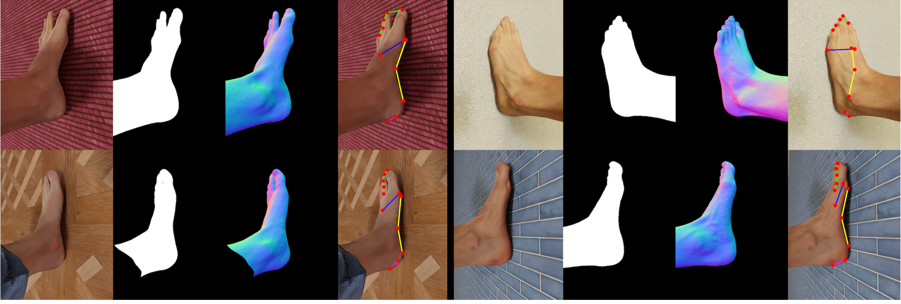

<p align="center">
  
</p>

# SynFoot




Synthetic foot dataset used for foot prediction tasks. As featured in:

> **FOUND: <ins>F</ins>oot <ins>O</ins>ptimisation with <ins>U</ins>ncertain <ins>N</ins>ormals for Surface <ins>D</ins>eformation using Synthetic Data**  \
> Winter Conference on Applications of Computer Vision 2024 \
> [Oliver Boyne](https://ollieboyne.github.io), [Gwangbin Bae](https://www.baegwangbin.com/), [James Charles](http://www.jjcvision.com), and [Roberto Cipolla](https://mi.eng.cam.ac.uk/~cipolla/) \
> [[arXiv]](https://arxiv.org/abs/2310.18279) [[project page]](https://ollieboyne.github.io/FOUND/)

Data was produced using our [BlenderSynth](https://ollieboyne.github.io/BlenderSynth) package.

## Install

| Dataset | Description                  | Download Link                                   | Readme                 |
|---------|------------------------------|-------------------------------------------------|------------------------|
| V1      | 50K RGB, normals, masks & keypoints | [Download](https://forms.gle/jZqoLPfQrkEa5XUF8) | [readme](v1_layout.md) |

### Normal format

Our normals are formatted in a *camera* relative reference frame, with RGB corresponding to XYZ, normalized in 0-255,
such that (0, 1, 0) -> (128, 255, 128).

In our format, (XYZ) = (left, up, back)


### Citation

If you use our work, please cite:

```
@inproceedings{boyne2024found,
            title={FOUND: {F}oot {O}ptimisation with {U}ncertain {N}ormals for Surface {D}eformation using Synthetic Data},
            author={Boyne, Oliver, and Bae, Gwangbin, and Charles, James and Cipolla, Roberto},
            booktitle={Winter Conference on Applications of Computer Vision (WACV)},
            year={2024}
}
```
